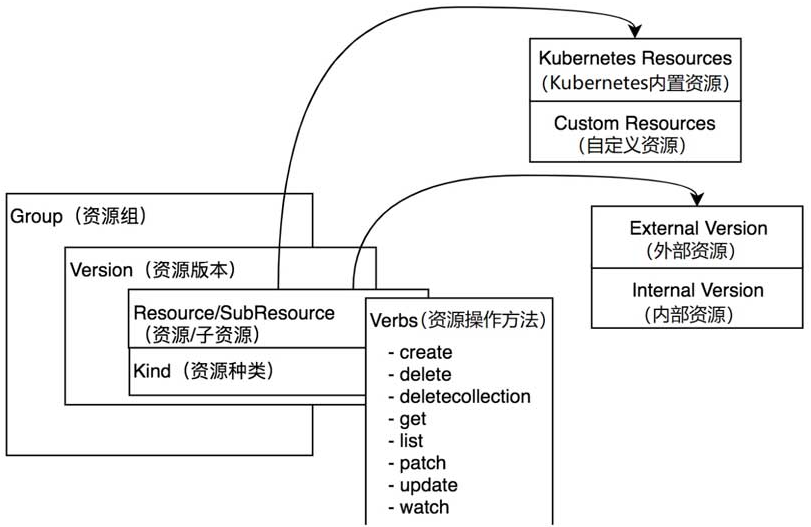
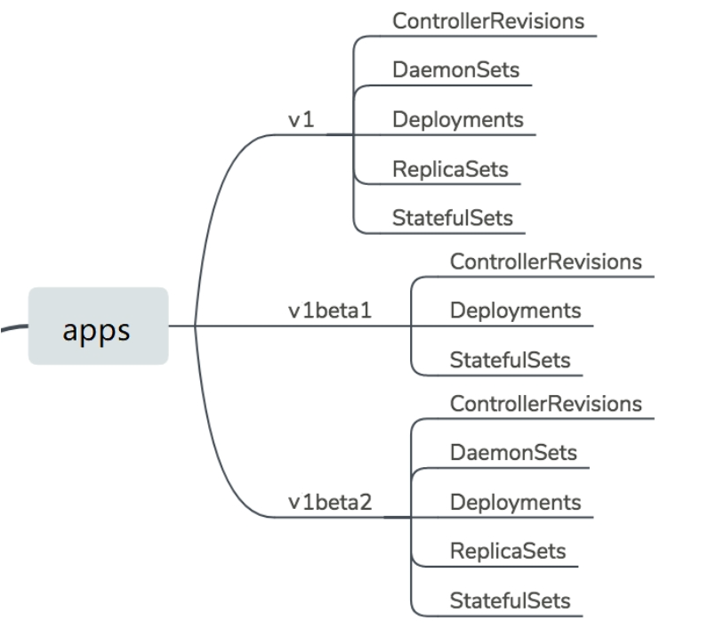
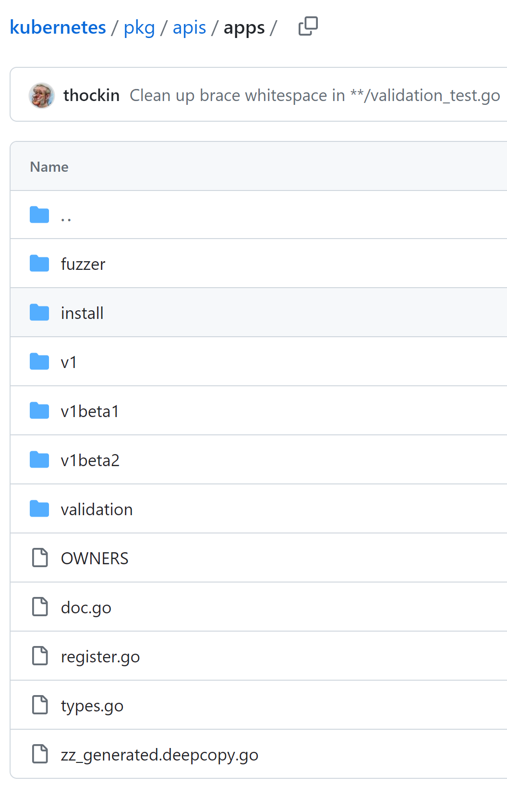

# 核心数据结构

[TOC]

## 概述

理解 Kubernetes 核心数据结构，在阅读源码时可以事半功倍并能够深刻理解 Kubernetes 核心设计。

## Group、Version、Resource

资源是 Kubernetes 中的最重要概念，Kubernetes 本质上就是资源管理系统，围绕着资源进行注册、管理和调度。

Kubernetes 对资源进行分组和版本化，进而有了 Group 和 Version 等概念：2

> Kubernetes 系统支持多个 Group，每个 Group 支持多个 Version，每个 Version 支持多个 Resource，其中部分资源同时会拥有自己的子资源（即 SubResource）。

概念 | 概念 | 命名 | 示例
-|-|-|-
资源 | Kubernetes 的 Restful 资源。| `<group>/<version>/<resource>[/<subresource>]` | `apps/v1/deployments/status`
核心组资源 | Group 为 core 的资源，这些资源可以省略 Group。 | `/<version>/<resource>[/<subresource>]` | `/v1/pods`
资源对象 | 资源的对象表达方式。由 “资源组 + 资源版本 + 资源种类” 组成。 | `<group>/<version>，Kind=<kind>` | `apps/v1，Kind=Deployment`



**注意：**

- 每一个资源都至少有两个版本，分别是外部版本（External Version）和内部版本（Internal Version）。
  - 外部版本用于对外暴露给用户请求的接口所使用的资源对象。
  - 内部版本不对外暴露，仅在 Kubernetes API Server 内部使用。
- 资源版本与资源外部版本、内部版本，是不同的概念。某个版本号的资源，有两种版本：外部版本和内部版本。

核心数据结构存放在 [vendor/k8s.io/apimachinery/pkg/apis/meta/v1](https://github.com/kubernetes/kubernetes/tree/master/staging/src/k8s.io/apimachinery/pkg/apis/meta/v1) 目录中。这些都是对资源定义的元数据。

## Group

Group（资源组），在 Kubernetes API Server 中也可称其为 APIGroup。

Kubernetes 系统中定义了许多资源组，这些资源组按照不同功能将资源进行了划分，资源组特点如下：

- 将众多资源按照功能划分成不同的资源组，并允许单独启用/禁用资源组。当然也可以单独启用/禁用资源组中的资源。
- 支持不同资源组中拥有不同的资源版本。这方便组内的资源根据版本进行迭代升级。
- 支持同名的资源种类（即 Kind）存在于不同的资源组内。
- 资源组与资源版本通过 Kubernetes API Server 对外暴露，允许开发者通过 HTTP协议进行交互并通过动态客户端（即 DynamicClient）进行资源发现。●
- 支持 CRD 自定义资源扩展。
- 用户交互简单，例如在使用 kubectl 命令行工具时，可以不填写资源组名称。

Kubernetes 对 Group 的定义：[vendor/k8s.io/apimachinery/pkg/apis/meta/v1/types.go](https://github.com/kubernetes/kubernetes/blob/master/staging/src/k8s.io/apimachinery/pkg/apis/meta/v1/types.go)。

```go
type APIGroup struct {
	TypeMeta `json:",inline"`

	// 资源组名称
	Name string `json:"name" protobuf:"bytes,1,opt,name=name"`

    // 资源组下所支持的资源版本
	Versions []GroupVersionForDiscovery `json:"versions" protobuf:"bytes,2,rep,name=versions"`
	
    // 首选版本。当一个资源组内存在多个资源版本时，Kubernetes API Server在使用资源时会选择一个首选版本作为当前版本。
	PreferredVersion GroupVersionForDiscovery `json:"preferredVersion,omitempty" protobuf:"bytes,3,opt,name=preferredVersion"`

	ServerAddressByClientCIDRs []ServerAddressByClientCIDR `json:"serverAddressByClientCIDRs,omitempty" protobuf:"bytes,4,rep,name=serverAddressByClientCIDRs"`
}
```

在当前的 Kubernetes 系统中，支持两类资源组，分别是拥有组名的资源组和没有组名的资源组：

- 拥有组名的资源组：其表现形式为 `<group>/<version>/<resource>`，例如 `apps/v1/deployments`。
- 没有组名的资源组：被称为 Core Groups（即核心资源组）或 Legacy Groups，也可被称为 GroupLess（即无组）。其表现形式为 `/<version>/<resource>`，例如 `/v1/pods`。

## Version

Kubernetes 的资源版本控制类似于语义版本控制（Semantic Versioning），在该基础上的资源版本定义允许版本号以 v 开头，例如v1beta1。

Kubernetes 的资源版本控制可分为 3 种，分别是 Alpha、Beta、Stable，它们之间的迭代顺序为：Alpha→Beta→Stable。其通常用来表示软件测试过程中的 3 个阶段。

版本 | 描述 | 默认 | 示例
-|-|-|-
Alpha | 内部测试版本，用于 Kubernetes 开发者内部测试。该版本是不稳定的，可能存在很多缺陷和漏洞，官方随时可能会放弃支持该版本。| 关闭 | v1alpha1、v1alpha2、v2alpha1
Beta | 相对稳定的版本，Beta 版本经过官方和社区很多次测试，当功能迭代时，该版本会有较小的改变，但不会被删除。| 开启 | v1beta1、v1beta2、v2beta1
Stable | 正式发布的版本，该版本不会被删除。| 开启 | v1、v2、v3。

Kubernetes 对 Group 的定义：[vendor/k8s.io/apimachinery/pkg/apis/meta/v1/types.go](https://github.com/kubernetes/kubernetes/blob/master/staging/src/k8s.io/apimachinery/pkg/apis/meta/v1/types.go)。

```go
type APIVersions struct {
	TypeMeta `json:",inline"`

	// 资源所支持的资源版本列表
	Versions []string `json:"versions" protobuf:"bytes,1,rep,name=versions"`

	ServerAddressByClientCIDRs []ServerAddressByClientCIDR `json:"serverAddressByClientCIDRs" protobuf:"bytes,2,rep,name=serverAddressByClientCIDRs"`
}
```

**注意：**

－　一个资源可能支持多个版本，因此 Versions 是个数组。

apps 资源组中所包括的版本和资源的示例（可以看出，像 Deployments 资源，处于多个版本下）：



## Resource

Kubernetes 对 Resource 的定义：[vendor/k8s.io/apimachinery/pkg/apis/meta/v1/types.go](https://github.com/kubernetes/kubernetes/blob/master/staging/src/k8s.io/apimachinery/pkg/apis/meta/v1/types.go)。

```go
type APIResource struct {
	// 资源名称。
	Name string `json:"name" protobuf:"bytes,1,opt,name=name"`

	// 资源的单数名称，它必须由小写字母组成，默认使用资源种类（Kind）的小写形式进行命名。
	SingularName string `json:"singularName" protobuf:"bytes,6,opt,name=singularName"`
	
    // 资源是否拥有所属命名空间。
	Namespaced bool `json:"namespaced" protobuf:"varint,2,opt,name=namespaced"`
	
    // group is the preferred group of the resource.  Empty implies the group of the containing resource list.
	// For subresources, this may have a different value, for example: Scale".
	Group string `json:"group,omitempty" protobuf:"bytes,8,opt,name=group"`
	
    // 资源所在的资源版本。
	Version string `json:"version,omitempty" protobuf:"bytes,9,opt,name=version"`
	
    // 资源种类。
	Kind string `json:"kind" protobuf:"bytes,3,opt,name=kind"`
	
    // 资源可操作的方法列表，例如get、list、delete、create、update等。
	Verbs Verbs `json:"verbs" protobuf:"bytes,4,opt,name=verbs"`
	
    // 资源的简称，例如Pod资源的简称为 po。
	ShortNames []string `json:"shortNames,omitempty" protobuf:"bytes,5,rep,name=shortNames"`
	
    // categories is a list of the grouped resources this resource belongs to (e.g. 'all')
	Categories []string `json:"categories,omitempty" protobuf:"bytes,7,rep,name=categories"`
}
```

**注意：**

- APIResource 是元数据对象，其实例代表的是某类 “资源”，而并非实际的资源 “实体”。

### 资源的内外版本

资源的内外版本，是 Kubernetes 实现多版本兼容的关键：

概念 | 中文 | 描述 | 示例 | 定义路径
-|-|-|-
External Object | 外部版本资源对象 | 也称为 Versioned Object。外部版本用于对外暴露给用户请求的接口所使用的资源对象。| apps/v1/deployments | `vendor/k8s.io/api//<group>/<version>/types.go`
Internal Object | 内部版本资源对象 | 内部版本不对外暴露，仅在 Kubernetes API Server 内部使用。| apps/__internal/deployments | `pkg/apis/<group>/types.go`

内部版本用于多资源版本的转换，例如将 v1beta1 版本转换为 v1 版本，其过程为： v1beta1 → internal → v1。

以 Pod 为例子，外部版本 v1 定义：[vendor/k8s.io/api/core/v1/types.go](https://github.com/kubernetes/kubernetes/blob/master/staging/src/k8s.io/api/core/v1/types.go)。

```go
type Pod struct {
	metav1.TypeMeta `json:",inline"`
	// Standard object's metadata.
	// More info: https://git.k8s.io/community/contributors/devel/sig-architecture/api-conventions.md#metadata
	// +optional
	metav1.ObjectMeta `json:"metadata,omitempty" protobuf:"bytes,1,opt,name=metadata"`

	// Specification of the desired behavior of the pod.
	// More info: https://git.k8s.io/community/contributors/devel/sig-architecture/api-conventions.md#spec-and-status
	// +optional
	Spec PodSpec `json:"spec,omitempty" protobuf:"bytes,2,opt,name=spec"`

	// Most recently observed status of the pod.
	// This data may not be up to date.
	// Populated by the system.
	// Read-only.
	// More info: https://git.k8s.io/community/contributors/devel/sig-architecture/api-conventions.md#spec-and-status
	// +optional
	Status PodStatus `json:"status,omitempty" protobuf:"bytes,3,opt,name=status"`
}
```

内部版本定义：[pkg/apis/core/types.go](https://github.com/kubernetes/kubernetes/blob/master/pkg/apis/core/types.go)。

```go
type Pod struct {
	metav1.TypeMeta

	// +optional
	metav1.ObjectMeta

	// Spec defines the behavior of a pod.
	// +optional
	Spec PodSpec

	// Status represents the current information about a pod. This data may not be up
	// to date.
	// +optional
	Status PodStatus
}
```

### 资源定义

Kubernetes 资源代码定义在 pkg/apis，将会包括如下内容：

- 支持的资源类型（types.go）。
- 资源验证方法（validation.go）。
- 资源注册至资源注册表的方法（install/install.go）。
- 资源外部版本的转换方法（conversion.go）。
- 资源外部版本的默认值（defaults.go）。

**注意：**

- 资源外部版本的结构体定义不在 pkg/apis 目录中。

以 Deployment 资源为例：



包括如下主要文件：

文件 | 描述
-|-
doc.go | GoDoc 文件，定义了当前包的注释信息。在 Kubernetes 资源包中，它还担当了代码生成器的全局 Tags 描述文件。
register.go | 定义了资源组、资源版本及资源的注册信息。
types.go | 定义了在当前资源组、资源版本下所支持的资源类型。
v1、v1beta1、v1beta2 目录 | 定义了资源组下拥有的资源版本的资源（即外部版本）。
install 目录 | 把当前资源组下的所有资源注册到资源注册表中。
validation 目录 | 定义了资源的验证方法。
zz_generated.deepcopy.go | 定义了资源的深复制操作，该文件由代码生成器自动生成。

### 将资源注册到资源注册表中

只有将资源注册到资源注册表中，该资源才能使用（实例化出资源实体）。

每个 Group 都有一个负责自己组的资源的注册，以 core 组为例子：[pkg/apis/core/install/install.go](https://github.com/kubernetes/kubernetes/blob/master/pkg/apis/core/install/install.go)。

```go
package install

import (
	"k8s.io/apimachinery/pkg/runtime"
	utilruntime "k8s.io/apimachinery/pkg/util/runtime"
	"k8s.io/kubernetes/pkg/api/legacyscheme"
	"k8s.io/kubernetes/pkg/apis/core"
	"k8s.io/kubernetes/pkg/apis/core/v1"
)

func init() {
	Install(legacyscheme.Scheme)
}

// Install registers the API group and adds types to a scheme
func Install(scheme *runtime.Scheme) {
	utilruntime.Must(core.AddToScheme(scheme))
	utilruntime.Must(v1.AddToScheme(scheme))
	utilruntime.Must(scheme.SetVersionPriority(v1.SchemeGroupVersion))
}
```

**注意：**

- **legacyscheme.Scheme** 是全局资源注册表，Kubernetes 的所有资源信息都交给资源注册表统一管理。
- core.AddToScheme 函数注册 core 资源组**内部版本**的资源。
- v1.AddToScheme 函数注册 core 资源组**外部版本**的资源。
- scheme.SetVersionPriority 函数注册资源组的版本顺序，如有多个资源版本，排在最前面的为资源首选版本。
- go 的 import 中 **"k8s.io/xxx"**，代表的是仓库中 `kubernetes/staging/src/k8s.io/xxx` 的目录或文件，可参考 [go.mod](https://github.com/kubernetes/kubernetes/blob/master/go.mod)。

### 资源首选版本


