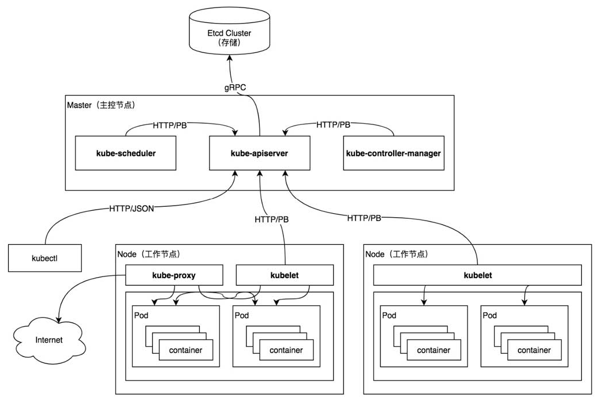
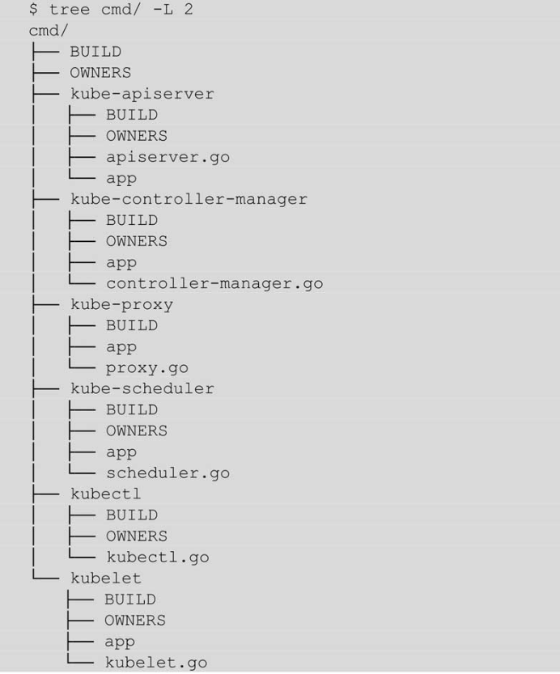
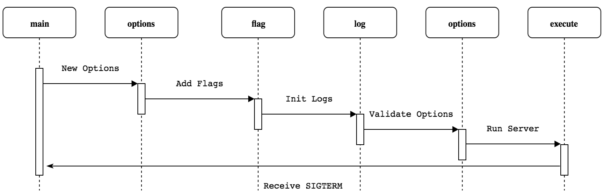
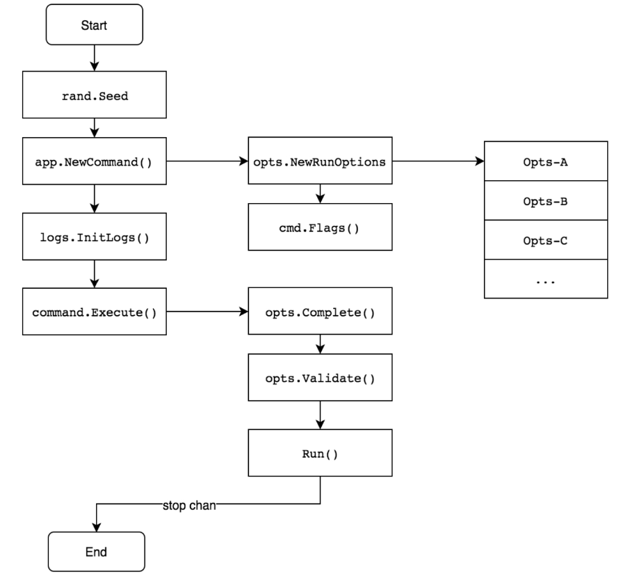

# Kubernetes 源码解析

[TOC]

## 概述

Kubernetes 开源仓库：[kubernetes](https://github.com/kubernetes/kubernetes)。

Kubernetes 系统用于管理分布式节点集群中的微服务或容器化应用程序，并且其提供了零停机时间部署、自动回滚、缩放和容器的自愈（其中包括自动配置、自动重启、自动复制的高弹性基础设施，以及容器的自动缩放等）等功能。



Kubernetes 系统架构遵循客户端/服务端架构，系统架构分为 Master 和 Node 两部分，Master 作为服务端，Node 作为客户端。

Master 服务端（主控节点）主要负责管理和控制整个 Kubernetes 集群，对集群做出全局性决策，相当于整个集群的“大脑”。集群所执行的所有控制命令都由 Master 服务端接收并处理：

- kube-apiserver 组件：集群的 HTTP REST API 接口，是集群控制的入口。
- kube-controller-manager 组件：集群中所有资源对象的自动化控制中心。
- kube-scheduler 组件：集群中Pod资源对象的调度服务。

Node 客户端（工作节点）是 Kubernetes 集群中的工作节点，Node 节点上的工作由 Master 服务端进行分配，比如当某个 Node 节点宕机时，Master 节点会将其上面的工作转移到其他 Node 节点上。包含的组件：

- kubelet 组件：负责管理节点上容器的创建、删除、启停等任务，与 Master 节点进行通信。
- kube-proxy 组件：负责 Kubernetes 服务的通信及负载均衡服务。
- container 组件：负责容器的基础管理服务，接收 kubelet 组件的指令。


**注意：**

- Kubernetes 系统具有多个 Master 服务端，可以实现高可用。
- 在默认的情况下，一个 Master 服务端即可完成所有工作。

## 各个组件功能

组件 | 描述 | 备注
-|-|-
kubectl | Kubernetes 官方提供的命令行工具（CLI），用户可以通过 kubectl 以命令行交互的方式对 Kubernetes API Server 进行操作。| -
client-go | kubernetes 的客户端库，通过编程的方式与 Kubernetes API Server 进行通信。| 也有其他客户端库，但是推荐使用 client-go，这是因为client-go在Kubernetes系统上做了大量的优化。Kubernetes 核心组件都使用 client-go。
kube-apiserver | 负责将 Kubernetes “资源组/资源版本/资源” 以 RESTful 风格的形式对外暴露并提供服务。Kubernetes 集群中的所有组件都通过 kube-apiserver 组件操作资源对象。kube-apiserver 组件也是集群中唯一与 Etcd 集群进行交互的核心组件。| -
kube-controller-manager | Controller Manager 负责确保 Kubernetes 系统的实际状态收敛到所需状态。每个控制器通过 kube-apiserver 组件提供的接口实时监控整个集群每个资源对象的当前状态，当因发生各种故障而导致系统状态出现变化时，会尝试将系统状态修复到 “期望状态” 。| Kubernetes 默认提供了一些控制器，例如 Deployment 控制器、StatefulSet 控制器、Namespace 控制器及 PersistentVolume 控制器等。
kube-scheduler | 负责在 Kubernetes 集群中为一个 Pod 资源对象找到合适的节点并在该节点上运行。监控整个集群的 Pod 资源对象和 Node 资源对象，当监控到新的 Pod 资源对象时，会通过调度算法为其选择最优节点。| 目前 Kubernetes 使用默认调度器。调度器每次只调度一个Pod资源对象，为每一个Pod资源对象寻找合适节点的过程是一个调度周期。
kubelet | 用于管理节点，运行在每个 Kubernetes 节点上。kubelet 组件用来接收、处理、上报 kube-apiserver 组件下发的任务。kubelet 进程启动时会向 kube-apiserver 注册节点自身信息。| -
kube-proxy | 节点上的网络代理，运行在每个 Kubernetes 节点上。它监控 kube-apiserver 的服务和端点资源变化，并通过 iptables/ipvs 等配置负载均衡器，为一组 Pod 提供统一的 TCP/UDP 流量转发和负载均衡功能。| -

## Kubernetes Project 目录布局

> 实际在 [kubernetes](https://github.com/kubernetes/kubernetes) 中的目录布局和书中所提到的布局已经有所差异，但是仍然可以作为参考。

Kubernetes 依据 [Standard Go Project Layout](https://github.com/golang-standards/project-layout) 进行的目录划分，具体为：

目录 | 描述
-|-
cmd/ | 存放可执行文件的入口代码，每个可执行文件都会有一个 main 函数。
pkg/ | 存放**核心库代码**，可被项目内部或外部引用。
staging/ | 存放部分**核心库代码**的目录。
vendor/ | 存放项目依赖的库代码，一般为第三方依赖，以及 Kubernetes 核心库代码。对于核心库， **vendor/k8s.io** 很多代码会通过软连接指向 staging 目录。
api/ | 存放 OpenAPI/Swagger 的 spec 文件，包括 JSON、Protocol 的定义等。
third_party/ | 存放第三方工具、代码或其他组件。
plugin/ | 存放 Kubernetes 插件代码目录，例如认证、授权等相关插件。
build/ | 存放与构建相关的脚本。
test/ | 存放测试工具及其测试数据。
docs/ | 存放设计或用户使用文档。
hack/ | 存放与测试、构建相关的脚本。
translations/ | 存放国际化语言包的相关文件。

## 最简单的源码：代码入口

各组件的代码入口 main 结构设计风格高度一致，过程也类似，非常作为我们学习 Kubernetes 源码的第一步，巩固自信心，收获成就感。

组件目录在 **cmd/** 目录下，各组件布局基本一致：



**注意：**

- 上图中的 **app** 是一个目录，是针对相应组件的入口的更多的实现和处理。

每个组件的运行过程也非常类似：



更具体而言，执行流程如下：



上图步骤如下：

1. 初始化随机种子
1. 构建应用程序的命令
1. 构建应用程序配置对象（Options，通过解析命令函参数得到）
1. 为命令添加命令函参数（Flags，解析命令函参数后，设置 Options 对象）
1. 初始化日志
1. 应用程序配置对象（Options 对象）补全默认值。
1. 应用程序配置对象（Options 对象）校验。
1. 运行应用程序。

## 附录：基本的依赖

这里记录一下 Kubernetes 使用的依赖。

### Cobra

这里 Kubernetes 的所有组件入口都依赖了 [Cobra](https://github.com/spf13/cobra)，这是一个强大的 Go 语言命令行库。除了 Kubernetes，还有很多其他的知名 Go 程序都使用了 Cobra。

这是一个使用 Cobra 的示例：

```go
package main

import (
    "fmt"
    "github.com/spf13/cobra"
)

func main() {
    var Version bool
    var rootCmd = &cobra.Command{
        Use: "root [sub]",
        Short: "root command",
        Run: func(cmd *cobra.Command, args []string) {
            fmt.Printf("Inside rootCmd Run with args: %v\n", args)
            if Version {
                fmt.Print("Version: 1.0\n")
            }
        }
    }

    flags := rootCmd.Flags()
    flags.BoolVarP(&Version, "version", "v", false, "Print version information and quit")
    _ = rootCmd.Execute()
}
```

Cobra 有三个步骤：

1. 创建最上层的根命令（cobra 支持子命令，并且广泛用于 Kubernetes 中），并定义 Run 函数。
1. 为命令添加命令行参数（通过 `cmd.Flags()` 得到命令函参数标识，对该标识对象添加参数）。
1. 执行 `cmd.Execute()`，cobra 会解析命令函，并最终会回调命令行定义的 Run 回调函数。

**Cobra 的 Flags 类型**

Kubernetes 中除了看到 `cmd.Flags()` 外，还可以看到一种 Flags：`cmd.PersistentFlags()`。所以在 Cobra 中有两种 Flags（命令函参数）：

- persistent：既可以设置给该 Command，又可以设置给该 Command 的子 Command。对于一些全局性的选项，比较适合设置为 persistent 类型。
- local：只能设置给指定的 Command。

**Cobra 的父子命令 Execute**

因为 Kubernetes 有非常多的子命令，但是入口函数中执行的是根命令的 Execute，那么是怎么触发子命令的 Run 回调呢？

其实在 Cobra 中，Command 的执行都会触发去寻找最符合条件的子命令。可以参考：[command.go](https://github.com/spf13/cobra/blob/main/command.go)。

> Execute uses the args (os.Args[1:] by default) and run through the command tree finding appropriate matches for commands and then corresponding flags.

找实际 Command 的函数在 ExecuteC 中实现，代码段：

```go
// ExecuteC executes the command.
func (c *Command) ExecuteC() (cmd *Command, err error) {
	// ...

    // 找对应的 cmd
	var flags []string
	if c.TraverseChildren {
		cmd, flags, err = c.Traverse(args)
	} else {
		cmd, flags, err = c.Find(args)
	}

    // ...

    // 执行对应 cmd 的 execute
	err = cmd.execute(flags)

    // ...
	return cmd, err
}
```
