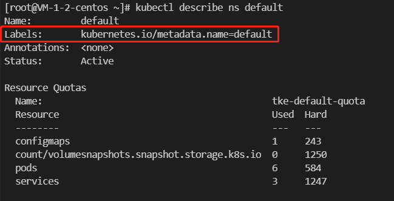

# 命名空间

在 Kubernetes 中，命名空间（Namespace） 提供一种机制：

- 将同一集群中的资源划分为相互隔离的组。
- 在同一命名空间内的资源名称（Name）要唯一，但跨命名空间时没有这个要求。

## 何时使用多个命名空间

命名空间适用于存在很多跨多个团队或项目的用户的场景。因此可以用命名空间来：

- 划分用户群体
- 划分不同项目
- 划分不同的运行环境（开发、测试、生产）

**注意：**

- 这里的项目并非业务的用户，而是 k8s 的使用者。
- 对于只有几到几十个用户的集群，根本不需要创建或考虑命名空间。

命名空间为名称提供了一个范围：

- 资源的名称需要在命名空间内是唯一的，但不能跨命名空间。
- 命名空间不能相互嵌套，每个 Kubernetes 资源只能在一个命名空间中。

命名空间是在多个用户之间划分集群资源的一种方法（通过资源配额）。

不必使用多个 namespace 来分隔仅仅轻微不同的资源，例如同一软件的不同版本：应该使用标签来区分不同资源的版本。

## 使用命名空间

### 查看命名空间

你可以使用以下命令列出集群中现存的命名空间：

```sh
$ kubectl get namespace
NAME              STATUS   AGE
default           Active   1d
kube-node-lease   Active   1d
kube-public       Active   1d
kube-system       Active   1d
```

Kubernetes 会创建四个初始命名空间：

- default，没有指明使用其它命名空间的对象所使用的默认命名空间。
- kube-system，Kubernetes 系统创建对象所使用的命名空间。
- kube-public，这个命名空间是自动创建的，所有用户（包括未经过身份验证的用户）都可以读取它。
  - 这个命名空间主要用于集群使用，以防某些资源在整个集群中应该是可见和可读的。
  - 这个命名空间的公共方面只是一种约定，而不是要求。
- kube-node-lease，此命名空间用于与各个节点相关的租约（Lease）对象。
  - 节点租期允许 kubelet 发送心跳，由此控制面能够检测到节点故障。

### 为 kubectl 操作设置命名空间

要为当前请求设置命名空间，请使用 --namespace 参数：

```sh
kubectl run nginx --image=nginx --namespace=<命名空间名称>

kubectl get pods --namespace=<命名空间名称>
```

### 设置命名空间偏好

想必每次 kubectl 操作都要输入 `--namespace=xxx` 非常麻烦吧，因此我们可以设置 kubectl 上下文的命名空间，后续 kubectl 操作都是使用该命名空间：

```txt
$ kubectl config set-context --current --namespace=kube-system
Context "cls-bo4javpy-99449107-context-default" modified.

# 验证
$ kubectl config view --minify | grep namespace:
namespace: kube-system
```

**注意：**

- 这个命名空间偏好设置和终端或者 shell 无关。重启 shell 也是生效的。

## 命名空间和 DNS

当你创建一个服务时，Kubernetes 会创建一个相应的 DNS 条目：

- 该条目的形式是 `<服务名称>.<命名空间名称>.svc.cluster.local` （这是完全限定域名 FQDN）。
- 这意味着如果容器只使用 `<服务名称>`，它将被解析到本地命名空间的服务（容器是在 Pod 里面的，Pod 是有命名空间的，也就是 Pod 直接使用服务名称，只会在相同命名空间下找 service）。

这对于跨多个命名空间（如开发、测试和生产） 使用相同的配置非常有用。如果你希望跨命名空间访问，则需要使用完全限定域名（FQDN）。

因此，所有的命名空间名称都必须是合法的 `RFC 1123 DNS`。

## 并非所有对象都在命名空间中

大多数 kubernetes 资源（例如 Pod、Service、副本控制器等）都位于某些命名空间中。

但是某些对象并不会有命名空间，例如：

- 命名空间资源本身并不在命名空间中
- 底层资源，例如节点和持久化卷不属于任何命名空间。

查看哪些 Kubernetes 资源在命名空间中，哪些不在命名空间中：

```sh
# 位于命名空间中的资源
kubectl api-resources --namespaced=true

# 不在命名空间中的资源
kubectl api-resources --namespaced=false
```

## 自动打标签

Kubernetes 控制面会为所有`命名空间对象`设置一个不可变更的标签 `kubernetes.io/metadata.name`。

只要 NamespaceDefaultLabelName 这一特性门控被启用，该标签的值是命名空间的名称。



**注意：**

- 这个只是影响命名空间对象，其他对象不会自动打这个标签。
