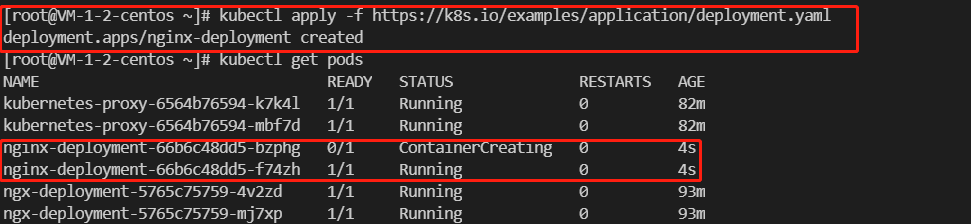

# Kubernetes 对象

说明了在 Kubernetes API 中是如何表示 Kubernetes 对象的，以及使用 `.yaml` 格式的文件表示 Kubernetes 对象。

## 理解 kubernetes 对象

在 Kubernetes 系统中，Kubernetes 对象是`持久化的实体`。

Kubernetes 使用这些实体去表示整个`集群的状态`。

它们描述了如下信息：

- 哪些容器化应用正在运行（以及在哪些节点上运行）
- 可以被应用程序使用的资源
- 关于应用运行时表现的策略，比如重启策略、升级策略以及容错策略


Kubernetes 对象是**目标性记录**：

- 一旦创建该对象，Kubernetes 系统将不断工作以确保该对象存在。
- 通过创建对象，你就是在告知 Kubernetes 系统，你想要的集群工作负载状态看起来应是什么样子的

换句话说，这就是 Kubernetes 集群所谓的`期望状态（Desired State）`。

对 Kubernetes 对象的操作（例如创建、修改或删除），需要使用 Kubernetes API。

当使用 kubectl 命令行接口（CLI）时，CLI 会调用必要的 Kubernetes API； 也可以在程序中使用客户端库， 来直接调用 Kubernetes API。

## 对象规约（Spec）与状态（Status）

几乎每个 Kubernetes 对象包含两个的对象字段，它们负责管理对象的配置：

- 对象 spec。对于对象的 spec，你必须在创建对象时设置其内容，描述你希望对象所具有的特征： 期望状态（Desired State）。
- 对象 status。描述了对象的当前状态（Current State），它是由 Kubernetes 系统和组件设置并更新的。

在任何时刻，`Kubernetes 控制平面`都一直都在积极地管理着对象的实际状态，以使之达成期望状态。

## 描述 Kubernetes 对象

创建 Kubernetes 对象时，必须：

> 提供对象的 spec，用来描述该对象的期望状态， 以及关于对象的一些基本信息（例如名称）。

当使用 Kubernetes API 创建对象时（直接创建，或经由 kubectl），API 请求必须在请求本体中包含 JSON 格式的信息

大多数情况下，你需要提供`.yaml`文件为 kubectl 提供这些信息。

**kubectl 在发起 API 请求时，将这些信息转换成 JSON 格式。**

**注意：**

- 很明显，Kubernetes API 其实是用的 JSON 格式，但是 kubectl 操作的时候用的 yaml，这个客户端会在调用 Kubernetes API 前将 yaml 转换为 JSON。

这里有一个 .yaml 示例文件，展示了 Kubernetes Deployment 的必需字段和对象 spec：

```yaml
apiVersion: apps/v1
kind: Deployment
metadata:
  name: nginx-deployment
spec:
  selector:
    matchLabels:
      app: nginx
  replicas: 2 # 告知 Deployment 运行 2 个与该模板匹配的 Pod
  template:
    metadata:
      labels:
        app: nginx
    spec:
      containers:
      - name: nginx
        image: nginx:1.14.2
        ports:
        - containerPort: 80
```

使用上述 .yaml 文件创建部署的一种方法是在 kubectl 命令行界面中使用 `kubectl apply` 命令，将 .yaml 文件作为参数传递。

这是一个例子：

```shell
kubectl apply -f https://k8s.io/examples/application/deployment.yaml
```

它将会输出：

```shell
deployment.apps/nginx-deployment created
```




## 必需字段

在想要创建的 Kubernetes 对象所对应的 .yaml 文件中，需要配置的字段如下：

- apiVersion - 创建该对象所使用的 Kubernetes API 的版本
- kind - 想要创建的对象的类别（例如 Deployment、Service 等）
- metadata - 对象元数据，例如：包括一个 name 字符串、UID 和可选的 namespace
- spec - 你所期望的该对象的状态

对每个 Kubernetes 对象而言，其 spec 之格式都是不同的，更具体地说：根据不同的 kind，其对象的 spec 格式是不同的。

我们能在 [Kubernetes API 参考](https://kubernetes.io/zh-cn/docs/reference/kubernetes-api/) 找到我们想要在 Kubernetes 上创建的任何对象的 spec 格式。
