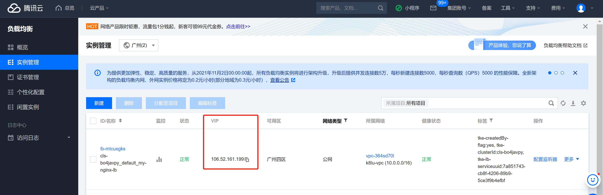

# 使用 Service 连接到应用

## Kubernetes 连接容器的模型

既然有了一个持续运行、可复制的应用，我们就能够将它暴露到网络上。

Kubernetes 假设 Pod 可与其它 Pod 通信，不管它们在哪个主机上。

Kubernetes 给每一个 Pod 分配一个集群私有 IP 地址，所以没必要在 Pod 与 Pod 之间创建连接或将容器的端口映射到主机端口。

这意味着**同一个 Pod 内**的所有容器能**通过 localhost 上的端口**互相连通，集群中的所有 Pod 也不需要通过 NAT 转换就能够互相看到。 

## 在集群中暴露 Pod

创建一个 Nginx Pod，注意其中包含一个容器端口的规约：

```yaml
apiVersion: apps/v1
kind: Deployment
metadata:
  name: my-nginx
spec:
  selector:
    matchLabels:
      run: my-nginx
  replicas: 2
  template:
    metadata:
      labels:
        run: my-nginx
    spec:
      containers:
      - name: my-nginx
        image: nginx
        ports:
        - containerPort: 80
```

这使得可以从集群中任何一个节点来访问它。检查节点，该 Pod 正在运行：

```sh
$ kubectl apply -f ./run-my-nginx.yaml

$ kubectl get pods -l run=my-nginx -o wide
NAME                        READY     STATUS    RESTARTS   AGE       IP            NODE
my-nginx-3800858182-jr4a2   1/1       Running   0          13s       10.244.3.4    kubernetes-minion-905m
my-nginx-3800858182-kna2y   1/1       Running   0          13s       10.244.2.5    kubernetes-minion-ljyd

# 检查 Pod 的 IP 地址：
kubectl get pods -l run=my-nginx -o custom-columns=POD_IP:.status.podIPs
    POD_IP
    [map[ip:10.244.3.4]]
    [map[ip:10.244.2.5]]
```

你应该能够通过 ssh 登录到集群中的任何一个 Node 上（但是不能 ssh 登录到 Pod IP），并使用诸如 curl 之类的工具向这两个 IP 地址发出查询请求。

需要注意的是，容器不会使用该节点上的 80 端口，也不会使用任何特定的 NAT 规则去路由流量到 Pod 上。这意味着可以在同一个节点上运行多个 Nginx Pod，使用相同的 containerPort，并且可以从集群中任何其他的 Pod 或节点上使用 IP 的方式访问到它们。

如果你想的话，你依然可以将宿主节点的某个端口的流量转发到 Pod 中，但是出于网络模型的原因，你不必这么做。

**注意：**

- Pod IP 是可以 ping 通的，但是 Cluster IP 不能 ping 通。
- containerPort 就是 Pod 对外暴露的端口，但是其实大多数时候不填也没关系，容器基础镜像本身会声明对外暴露声明端口。

## 创建 Service

我们有一组在一个扁平的、集群范围的地址空间中运行 Nginx 服务的 Pod。 理论上，你可以直接连接到这些 Pod，但如果某个节点死掉了会发生什么呢？ Pod 会终止，Deployment 将创建新的 Pod，且使用不同的 IP。这正是 Service 要解决的问题。

Kubernetes Service 是集群中提供相同功能的一组 Pod 的抽象表达。 当每个 Service 创建时，会被分配一个唯一的 IP 地址（也称为 clusterIP）。

这个 Cluster IP 地址与 Service 的生命周期绑定在一起：**只要 Service 存在，Cluster IP 就不会改变**。

可以配置 Pod 使它与 Service 进行通信，Pod 知道与 Service 通信将被自动地负载均衡到该 Service 中的某些 Pod 上。

可以使用 kubectl expose 命令为 2个 Nginx 副本创建一个 Service：

```sh
$ kubectl expose deployment/my-nginx
service/my-nginx exposed
```

expose 命令等价于使用了 service yaml：

```yaml
apiVersion: v1
kind: Service
metadata:
  name: my-nginx
  labels:
    run: my-nginx
spec:
  ports:
  - port: 80
    protocol: TCP
  selector:
    run: my-nginx
```

查看 service 信息：

```sh
$ kubectl get svc my-nginx
NAME       TYPE        CLUSTER-IP     EXTERNAL-IP   PORT(S)   AGE
my-nginx   ClusterIP   10.0.162.149   <none>        80/TCP    21s
```

正如前面所提到的，一个 Service 由一组 Pod 提供支撑。这些 Pod 通过 endpoints 暴露出来。

Service Selector 将持续评估，结果被 POST 到一个名称为 my-nginx 的 Endpoint 对象上。当 Pod 终止后，它会自动从 Endpoint 中移除，新的能够匹配上 Service Selector 的 Pod 将自动地被添加到 Endpoint 中。检查该 Endpoint，注意到 IP 地址与在第一步创建的 Pod 是相同的。

Endpoints 可以查看 endpoints 资源，也可以直接在 svc 资源里面看：

```sh
# 通过 svc 查看
$ kubectl describe svc my-nginx
Name:                my-nginx
Namespace:           default
Labels:              run=my-nginx
Annotations:         <none>
Selector:            run=my-nginx
Type:                ClusterIP
IP:                  10.0.162.149
Port:                <unset> 80/TCP
Endpoints:           10.244.2.5:80,10.244.3.4:80
Session Affinity:    None
Events:              <none>

# 通过 ep 资源查看
$ kubectl get ep my-nginx
```

现在，你应该能够从集群中**任意节点**（包括 Pod）上使用 curl 命令向 `<CLUSTER-IP>:<PORT>` 发送请求以访问 Nginx Service。

注意 Service IP 完全是虚拟的，它从来没有走过网络，如果对它如何工作的原理感到好奇， 可以进一步阅读服务代理 的内容。

**注意：**

- expose 形式会直接使用 Pod port 作为 service 的 target port
- 如果 deployment 中修改了 pod port，service 对应的 target port 是无法修改的，一般需要删除 svc 后重新创建

## 访问 Service

Kubernetes 支持两种查找服务的主要模式: 环境变量和 DNS。前者开箱即用，而后者则需要 CoreDNS 集群插件.

**说明：**

- 如果不需要服务环境变量（因为可能与预期的程序冲突，可能要处理的变量太多，或者仅使用DNS等），则可以通过在 pod spec 上将 enableServiceLinks 标志设置为 false 来禁用此模式。

### 环境变量

### DNS

Kubernetes 提供了一个自动为其它 Service 分配 DNS 名字的 DNS 插件 Service。 你可以通过如下命令检查它是否在工作：

```sh
$ kubectl get services kube-dns --namespace=kube-system
NAME       TYPE        CLUSTER-IP   EXTERNAL-IP   PORT(S)         AGE
kube-dns   ClusterIP   10.0.0.10    <none>        53/UDP,53/TCP   8m
```

我们可以通过一个 curl 工具来做相关的 dns 测试：

```sh
# 创建一个 pod 并直接进入
[root@VM-1-2-centos ~]# kubectl run curl --image=radial/busyboxplus:curl -i --tty
If you don't see a command prompt, try pressing enter.
[ root@curl:/ ]$ 
[ root@curl:/ ]$ nslookup my-nginx
Server:    172.16.254.137
Address 1: 172.16.254.137 kube-dns.kube-system.svc.cluster.local

Name:      my-nginx
Address 1: 172.16.253.3 my-nginx.default.svc.cluster.local

# 第一组 Server 和 Address 1 是 dns 解析服务器的
# 第二组 Name 和 Address 1 是域名和解析出的地址，以及其他可用的域名
# curl "http://172.16.253.3"
# curl "http://my-nginx.default.svc.cluster.local"
# curl "http://my-nginx"
# 上面三个都能请求通
```

## 保护 Service

到现在为止，我们只在集群内部访问了 Nginx 服务器。

在将 Service 暴露到因特网之前，我们希望确保通信信道是安全的。 为实现这一目的，需要：

- 用于 HTTPS 的自签名证书（除非已经有了一个身份证书）
- 使用证书配置的 Nginx 服务器
- 使 Pod 可以访问证书的 Secret


你可以从 Nginx https 示例获取所有上述内容。你需要安装 go 和 make 工具。如果你不想安装这些软件，可以按照后文所述的手动执行步骤执行操作。

简要过程如下：

```sh
$ make keys KEY=/tmp/nginx.key CERT=/tmp/nginx.crt
$ kubectl create secret tls nginxsecret --key /tmp/nginx.key --cert /tmp/nginx.crt
secret/nginxsecret created

# 这时就创建好了用于 tls 的证书，并且是存放在 secret 中的
$ kubectl get secrets
NAME                  TYPE                                  DATA      AGE
nginxsecret           kubernetes.io/tls                     2         1m
```

以下是 configmap

```sh
$ kubectl create configmap nginxconfigmap --from-file=default.conf
configmap/nginxconfigmap created

$ kubectl get configmaps
NAME             DATA   AGE
nginxconfigmap   1      114s

# 创建公钥和相对应的私钥
openssl req -x509 -nodes -days 365 -newkey rsa:2048 -keyout /d/tmp/nginx.key -out /d/tmp/nginx.crt -subj "/CN=my-nginx/O=my-nginx"
# 对密钥实施 base64 编码
cat /d/tmp/nginx.crt | base64
cat /d/tmp/nginx.key | base64
```

使用前面输出的证书和密钥，生成 secret yaml 文件：

```yaml
apiVersion: "v1"
kind: "Secret"
metadata:
  name: "nginxsecret"
  namespace: "default"
type: kubernetes.io/tls  
data:
  tls.crt: "LS0tLS1CRUdJTiBDRVJUSUZJQ0FURS0tLS0tCk1JSURIekNDQWdlZ0F3SUJBZ0lKQUp5M3lQK0pzMlpJTUEwR0NTcUdTSWIzRFFFQkJRVUFNQ1l4RVRBUEJnTlYKQkFNVENHNW5hVzU0YzNaak1SRXdEd1lEVlFRS0V3aHVaMmx1ZUhOMll6QWVGdzB4TnpFd01qWXdOekEzTVRKYQpGdzB4T0RFd01qWXdOekEzTVRKYU1DWXhFVEFQQmdOVkJBTVRDRzVuYVc1NGMzWmpNUkV3RHdZRFZRUUtFd2h1CloybHVlSE4yWXpDQ0FTSXdEUVlKS29aSWh2Y05BUUVCQlFBRGdnRVBBRENDQVFvQ2dnRUJBSjFxSU1SOVdWM0IKMlZIQlRMRmtobDRONXljMEJxYUhIQktMSnJMcy8vdzZhU3hRS29GbHlJSU94NGUrMlN5ajBFcndCLzlYTnBwbQppeW1CL3JkRldkOXg5UWhBQUxCZkVaTmNiV3NsTVFVcnhBZW50VWt1dk1vLzgvMHRpbGhjc3paenJEYVJ4NEo5Ci82UVRtVVI3a0ZTWUpOWTVQZkR3cGc3dlVvaDZmZ1Voam92VG42eHNVR0M2QURVODBpNXFlZWhNeVI1N2lmU2YKNHZpaXdIY3hnL3lZR1JBRS9mRTRqakxCdmdONjc2SU90S01rZXV3R0ljNDFhd05tNnNTSzRqYUNGeGpYSnZaZQp2by9kTlEybHhHWCtKT2l3SEhXbXNhdGp4WTRaNVk3R1ZoK0QrWnYvcW1mMFgvbVY0Rmo1NzV3ajFMWVBocWtsCmdhSXZYRyt4U1FVQ0F3RUFBYU5RTUU0d0hRWURWUjBPQkJZRUZPNG9OWkI3YXc1OUlsYkROMzhIYkduYnhFVjcKTUI4R0ExVWRJd1FZTUJhQUZPNG9OWkI3YXc1OUlsYkROMzhIYkduYnhFVjdNQXdHQTFVZEV3UUZNQU1CQWY4dwpEUVlKS29aSWh2Y05BUUVGQlFBRGdnRUJBRVhTMW9FU0lFaXdyMDhWcVA0K2NwTHI3TW5FMTducDBvMm14alFvCjRGb0RvRjdRZnZqeE04Tzd2TjB0clcxb2pGSW0vWDE4ZnZaL3k4ZzVaWG40Vm8zc3hKVmRBcStNZC9jTStzUGEKNmJjTkNUekZqeFpUV0UrKzE5NS9zb2dmOUZ3VDVDK3U2Q3B5N0M3MTZvUXRUakViV05VdEt4cXI0Nk1OZWNCMApwRFhWZmdWQTRadkR4NFo3S2RiZDY5eXM3OVFHYmg5ZW1PZ05NZFlsSUswSGt0ejF5WU4vbVpmK3FqTkJqbWZjCkNnMnlwbGQ0Wi8rUUNQZjl3SkoybFIrY2FnT0R4elBWcGxNSEcybzgvTHFDdnh6elZPUDUxeXdLZEtxaUMwSVEKQ0I5T2wwWW5scE9UNEh1b2hSUzBPOStlMm9KdFZsNUIyczRpbDlhZ3RTVXFxUlU9Ci0tLS0tRU5EIENFUlRJRklDQVRFLS0tLS0K"
  tls.key: "LS0tLS1CRUdJTiBQUklWQVRFIEtFWS0tLS0tCk1JSUV2UUlCQURBTkJna3Foa2lHOXcwQkFRRUZBQVNDQktjd2dnU2pBZ0VBQW9JQkFRQ2RhaURFZlZsZHdkbFIKd1V5eFpJWmVEZWNuTkFhbWh4d1NpeWF5N1AvOE9ta3NVQ3FCWmNpQ0RzZUh2dGtzbzlCSzhBZi9WemFhWm9zcApnZjYzUlZuZmNmVUlRQUN3WHhHVFhHMXJKVEVGSzhRSHA3VkpMcnpLUC9QOUxZcFlYTE0yYzZ3MmtjZUNmZitrCkU1bEVlNUJVbUNUV09UM3c4S1lPNzFLSWVuNEZJWTZMMDUrc2JGQmd1Z0ExUE5JdWFubm9UTWtlZTRuMG4rTDQKb3NCM01ZUDhtQmtRQlAzeE9JNHl3YjREZXUraURyU2pKSHJzQmlIT05Xc0RadXJFaXVJMmdoY1kxeWIyWHI2UAozVFVOcGNSbC9pVG9zQngxcHJHclk4V09HZVdPeGxZZmcvbWIvNnBuOUYvNWxlQlkrZStjSTlTMkQ0YXBKWUdpCkwxeHZzVWtGQWdNQkFBRUNnZ0VBZFhCK0xkbk8ySElOTGo5bWRsb25IUGlHWWVzZ294RGQwci9hQ1Zkank4dlEKTjIwL3FQWkUxek1yall6Ry9kVGhTMmMwc0QxaTBXSjdwR1lGb0xtdXlWTjltY0FXUTM5SjM0VHZaU2FFSWZWNgo5TE1jUHhNTmFsNjRLMFRVbUFQZytGam9QSFlhUUxLOERLOUtnNXNrSE5pOWNzMlY5ckd6VWlVZWtBL0RBUlBTClI3L2ZjUFBacDRuRWVBZmI3WTk1R1llb1p5V21SU3VKdlNyblBESGtUdW1vVlVWdkxMRHRzaG9reUxiTWVtN3oKMmJzVmpwSW1GTHJqbGtmQXlpNHg0WjJrV3YyMFRrdWtsZU1jaVlMbjk4QWxiRi9DSmRLM3QraTRoMTVlR2ZQegpoTnh3bk9QdlVTaDR2Q0o3c2Q5TmtEUGJvS2JneVVHOXBYamZhRGR2UVFLQmdRRFFLM01nUkhkQ1pKNVFqZWFKClFGdXF4cHdnNzhZTjQyL1NwenlUYmtGcVFoQWtyczJxWGx1MDZBRzhrZzIzQkswaHkzaE9zSGgxcXRVK3NHZVAKOWRERHBsUWV0ODZsY2FlR3hoc0V0L1R6cEdtNGFKSm5oNzVVaTVGZk9QTDhPTm1FZ3MxMVRhUldhNzZxelRyMgphRlpjQ2pWV1g0YnRSTHVwSkgrMjZnY0FhUUtCZ1FEQmxVSUUzTnNVOFBBZEYvL25sQVB5VWs1T3lDdWc3dmVyClUycXlrdXFzYnBkSi9hODViT1JhM05IVmpVM25uRGpHVHBWaE9JeXg5TEFrc2RwZEFjVmxvcG9HODhXYk9lMTAKMUdqbnkySmdDK3JVWUZiRGtpUGx1K09IYnRnOXFYcGJMSHBzUVpsMGhucDBYSFNYVm9CMUliQndnMGEyOFVadApCbFBtWmc2d1BR
```

就可以创建 secret 文件，并且进行配置了：

```sh
$ kubectl apply -f nginxsecrets.yaml

$ kubectl get secrets
NAME                  TYPE                                  DATA      AGE
nginxsecret           kubernetes.io/tls                     2         1m
```

现在修改 nginx 副本以启动一个使用 Secret 中的证书的 HTTPS 服务器以及相应的用于暴露其端口（80 和 443）的 Service：

```yaml
apiVersion: v1
kind: Service
metadata:
  name: my-nginx
  labels:
    run: my-nginx
spec:
  type: NodePort
  ports:
  - port: 8080
    targetPort: 80
    protocol: TCP
    name: http
  - port: 443
    protocol: TCP
    name: https
  selector:
    run: my-nginx
---
apiVersion: apps/v1
kind: Deployment
metadata:
  name: my-nginx
spec:
  selector:
    matchLabels:
      run: my-nginx
  replicas: 1
  template:
    metadata:
      labels:
        run: my-nginx
    spec:
      volumes:
      - name: secret-volume
        secret:
          secretName: nginxsecret
      - name: configmap-volume
        configMap:
          name: nginxconfigmap
      containers:
      - name: nginxhttps
        image: bprashanth/nginxhttps:1.0
        ports:
        - containerPort: 443
        - containerPort: 80
        volumeMounts:
        - mountPath: /etc/nginx/ssl
          name: secret-volume
        - mountPath: /etc/nginx/conf.d
          name: configmap-volume
```


## 暴露 Service

对应用的某些部分，你可能希望将 Service 暴露在一个外部 IP 地址上。

Kubernetes 支持两种实现方式：

- NodePort
- LoadBalancer

在上一段创建的 Service 使用了 NodePort，因此，如果你的节点有一个公网 IP，那么 Nginx HTTPS 副本已经能够处理因特网上的流量。

让我们创建一个 Service 以使用云负载均衡器：

```yaml
apiVersion: v1
kind: Service
metadata:
  name: my-nginx-lb
  labels:
    run: my-nginx-lb
spec:
  type: LoadBalancer
  ports:
    - port: 80
      protocol: TCP
  selector:
    run: my-nginx-lb
---
apiVersion: apps/v1
kind: Deployment
metadata:
  name: my-nginx-lb
spec:
  selector:
    matchLabels:
      run: my-nginx-lb
  replicas: 2
  template:
    metadata:
      labels:
        run: my-nginx-lb
    spec:
      containers:
      - name: my-nginx-lb
        image: nginx
        ports:
        - containerPort: 80
```

构建 lb 的 service：

```sh
# 最开始会 external-ip 会 pending 一段时间，这是在构建入口
$ kubectl get svc
NAME                  TYPE           CLUSTER-IP       EXTERNAL-IP   PORT(S)         AGE
my-nginx-lb           LoadBalancer   172.16.254.77    <pending>     80:31642/TCP    8s

# 完成构建 lb：
$ kubectl get svc
NAME                  TYPE           CLUSTER-IP       EXTERNAL-IP   PORT(S)         AGE
my-nginx-lb           LoadBalancer   172.16.254.77    106.52.161.199   80:31642/TCP    13s
# 看起来还同时有 NodePort 的生效

# describe
$ kubectl describe svc my-nginx-lb
Name:                     my-nginx-lb
Namespace:                default
Labels:                   run=my-nginx-lb
Annotations:              service.kubernetes.io/loadbalance-id: lb-mtcuxgks
Selector:                 run=my-nginx-lb
Type:                     LoadBalancer
IP Family Policy:         SingleStack
IP Families:              IPv4
IP:                       172.16.254.77
IPs:                      172.16.254.77
LoadBalancer Ingress:     106.52.161.199
Port:                     <unset>  80/TCP
TargetPort:               80/TCP
NodePort:                 <unset>  31642/TCP
Endpoints:                172.16.0.53:80,172.16.0.90:80
Session Affinity:         None
External Traffic Policy:  Cluster
Events:
  Type    Reason                Age                  From                Message
  ----    ------                ----                 ----                -------
  Normal  EnsureServiceSuccess  107s (x2 over 108s)  service-controller  Service Sync Success. RetrunCode: S2000
```

我用的是腾讯云，构造 LoadBalancer 会导致创建负载均衡器：



对 service 进行 delete 后，该 clb 会直接消失。
