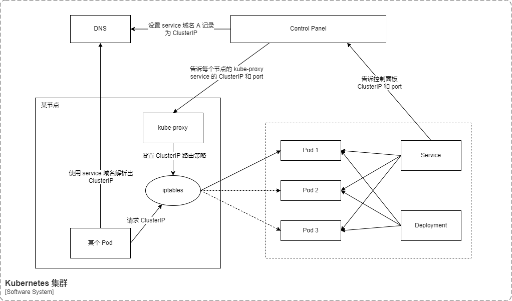
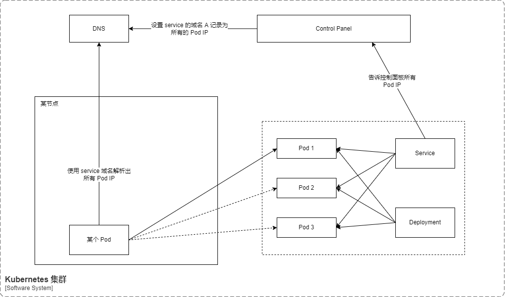

# 服务、负载均衡和联网

## Kubernetes 网络模型

集群中每一个 Pod 都会获得自己的、 独一无二的 IP 地址，这就意味着你不需要显式地在 Pod 之间创建链接，你几乎不需要处理容器端口到主机端口之间的映射。

这将形成一个干净的、向后兼容的模型；在这个模型里，从端口分配、命名、服务发现、 负载均衡、 应用配置和迁移的角度来看，Pod 可以被视作虚拟机或者物理主机。

Kubernetes 强制要求所有网络设施都满足以下基本要求（从而排除了有意隔离网络的策略）：

- Pod 能够与所有其他节点上的 Pod 通信， 且不需要网络地址转译（NAT）
- 节点上的代理（比如：系统守护进程、kubelet）可以和节点上的所有 Pod 通信


说明：对于支持在主机网络中运行 Pod 的平台（比如：Linux），当 Pod 挂接到节点的宿主网络上时，它们仍可以不通过 NAT 和所有节点上的 Pod 通信。

这个模型不仅不复杂，而且还和 Kubernetes 的实现从虚拟机向容器平滑迁移的初衷相符，如果你的任务开始是在虚拟机中运行的，你的虚拟机有一个 IP， 可以和项目中其他虚拟机通信。这里的模型是基本相同的。

Kubernetes 的 IP 地址存在于 Pod 范围内 —— 容器共享它们的网络命名空间 —— 包括它们的 IP 地址和 MAC 地址。 这就意味着 Pod 内的容器都可以通过 localhost 到达对方端口。 这也意味着 Pod 内的容器需要相互协调端口的使用，但是这和虚拟机中的进程似乎没有什么不同， 这也被称为“一个 Pod 一个 IP”模型。

如何实现以上需求是所使用的特定容器运行时的细节。

也可以在 Node 本身请求端口，并用这类端口转发到你的 Pod（称之为主机端口），但这是一个很特殊的操作。转发方式如何实现也是容器运行时的细节。 Pod 自己并不知道这些主机端口的存在。

Kubernetes 网络解决四方面的问题：

- 一个 Pod 中的容器之间通过本地回路（loopback）通信。
- 集群网络在不同 pod 之间提供通信。
- Service 资源允许你 向外暴露 Pods 中运行的应用， 以支持来自于集群外部的访问。
- 可以使用 Services 来发布仅供集群内部使用的服务。

## Service 工作图示

Service 有以下工作模式：

Service Type | subtype | 集群内部访问 | 集群外部访问
-|-|-|-
ClusterIP | Normal | 为集群内部访问提供 VIP。| 不支持
ClusterIP | Headless | 不创建 VIP，集群内部访问依赖于 DNS 的 A 记录。| 不支持
NodePort | - | 为集群内部访问提供 VIP。| 集群外部访问使用集群任意节点和某个对外的端口。外部请求 NodePort 时，会转发给 VIP。
LoadBalancer | - | 为集群内部访问提供 VIP。| 会构造 NodePort，同时以使用使用云提供商的 LB 向外部暴露服务。LB 会负载均衡的转发给内网的 NodePort。

**注意：**

- 上述提到的 VIP 机制，基于网络代理机制，常见的代理机制是 iptables。

### ClusterIP

启用方式：

- Service yaml 的 `.spec.type` 设置为 `ClusterIP` 或者不设置（默认就是 ClusterIP）。
- Service yaml 的 `.spec.ClusterIP` 设置为有效且不冲突的集群 IP 或者不设置（默认是随机生成一个 ClusterIP）。



配置示例：

```yaml
apiVersion: apps/v1
kind: Deployment
metadata:
  name: my-nginx
spec:
  selector:
    matchLabels:
      run: my-nginx
  replicas: 2
  template:
    metadata:
      labels:
        run: my-nginx
    spec:
      containers:
      - name: my-nginx
        image: nginx
        ports:
        - containerPort: 80
---
apiVersion: v1
kind: Service
metadata:
  name: my-nginx
  labels:
    run: my-nginx
spec:
  ports:
    - port: 80
      protocol: TCP
      # targetPort 是转发的目标端口，不设置就用
      # targetPort: 80
  selector:
    run: my-nginx
  # 不设置 ClusterIP 就会随机选择
  # ClusterIP: 10.0.171.239
  # 不设置 type，默认就是 ClusterIP
  # type: ClusterIP
```

### Headless Service

启用方式：

- Service yaml 的 `.spec.type` 设置为 `ClusterIP` 或者不设置（默认就是 ClusterIP）。
- Service yaml 的 `.spec.ClusterIP` 设置为 `None`。



配置示例：

```yaml
apiVersion: apps/v1
kind: Deployment
metadata:
  name: my-nginx-nodeport
spec:
  selector:
    matchLabels:
      run: my-nginx-nodeport
  replicas: 2
  template:
    metadata:
      labels:
        run: my-nginx-nodeport
    spec:
      containers:
      - name: my-nginx-nodeport
        image: nginx
        ports:
        - containerPort: 80
---
apiVersion: v1
kind: Service
metadata:
  name: my-nginx-nodeport
  labels:
    run: my-nginx-nodeport
spec:
  type: NodePort
  ports:
    - port: 80
      protocol: TCP
  selector:
    run: my-nginx-nodeport
```
