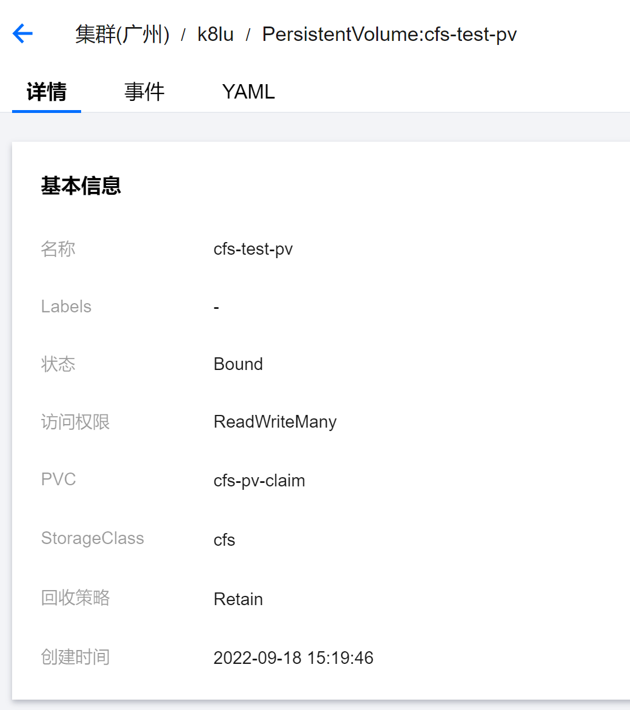

# 持久卷

[TOC]

## 概览

存储的管理是一个与计算实例的管理完全不同的问题。

PersistentVolume 为用户和管理员提供了一组 API，将 Storage 如何制备的细节从其如何被使用中抽象出来（分离了实现与细节）。

为了实现这点，我们引入了两个新的 API 资源：

- PersistentVolume，集群中的存储，需要事先或动态制备。类似于 Node，是集群资源。
- PersistentVolumeClaim，是用户对存储的请求，耗用 PV 资源。

持久卷（PersistentVolume，PV）是集群中的一块存储，可以由管理员事先制备，或者使用存储类（Storage Class）来动态制备。PV 是集群资源，就像节点也是集群资源一样。PV 持久卷和普通的 Volume 一样，也是使用卷插件来实现的，只是它们拥有独立于任何使用 PV 的 Pod 的生命周期。PV API 对象中记述了存储的实现细节，无论其背后是 NFS、iSCSI 还是特定于云平台的存储系统。

持久卷申领（PersistentVolumeClaim，PVC）是用户对存储的请求。概念上与 Pod 类似。Pod 会耗用节点资源，而 PVC 申领会耗用 PV 资源。Pod 可以请求特定数量的资源（CPU 和内存）；同样 PVC 申领也可以请求特定的大小和访问模式 （例如，可以要求 PV 卷能够以 ReadWriteOnce、ReadOnlyMany 或 ReadWriteMany 模式之一来挂载，参见访问模式）。

尽管 PersistentVolumeClaim 允许用户消耗抽象的存储资源， 常见的情况是针对不同的问题用户需要的是具有不同属性（如，性能）的 PersistentVolume 卷。 集群管理员需要能够提供不同性质的 PersistentVolume，并且这些 PV 卷之间的差别不仅限于卷大小和访问模式，同时又不能将卷是如何实现的这些细节暴露给用户。 为了满足这类需求，就有了 **存储类（StorageClass）** 资源。

参见[基于运行示例的详细演练](https://kubernetes.io/zh-cn/docs/tasks/configure-pod-container/configure-persistent-volume-storage/)。

一个制备 hostPath 的 PV 示例：

```yaml
apiVersion: v1
kind: PersistentVolume
metadata:
  name: task-pv-volume
  labels:
    type: local
spec:
  storageClassName: manual
  capacity:
    storage: 10Gi
  accessModes:
    - ReadWriteOnce
  hostPath:
    path: "/mnt/data"
```

一个 PVC 示例：

```yaml
apiVersion: v1
kind: PersistentVolumeClaim
metadata:
  name: task-pv-claim
spec:
  storageClassName: manual
  accessModes:
    - ReadWriteOnce
  resources:
    requests:
      storage: 3Gi
```

Pod 使用 PVC 示例：

```yaml
apiVersion: v1
kind: Pod
metadata:
  name: task-pv-pod
spec:
  volumes:
    - name: task-pv-storage
      persistentVolumeClaim:
        claimName: task-pv-claim
  containers:
    - name: task-pv-container
      image: nginx
      ports:
        - containerPort: 80
          name: "http-server"
      volumeMounts:
        - mountPath: "/usr/share/nginx/html"
          name: task-pv-storage
```

Deployment 使用 PVC 示例：

```yaml
apiVersion: apps/v1
kind: Deployment
metadata:
  name: task-pv-dep
spec:
  selector:
    matchLabels:
      app: task-pv-dep
  replicas: 2
  template:
    metadata:
      labels:
        app: task-pv-dep
    spec:
      containers:
      - name: task-pv-dep-nginx
        image: nginx
        ports:
        - containerPort: 80
        volumeMounts:
        - mountPath: "/usr/share/nginx/html"
          name: task-pv-storage
      volumes:
      - name: task-pv-storage
        persistentVolumeClaim:
          claimName: task-pv-claim
```

**注意：**

- 上面使用 Deployment 时，有两个副本，会分布到两个节点，但是只有一个节点配置了 index.html，所以有一个 PodIP:PodPort 访问过去无法拿到有效响应。

## 卷和申领的生命周期

PV 是集群中的资源，PVC 申领是对这些资源的请求，也被用来执行对资源的申领检查。

PV 和 PVC 申领之间的互动遵循如下生命周期：

### 制备

PV 卷的制备有两种方式：静态制备或动态制备。

#### 静态制备

集群管理员预先创建若干 PV，这些卷对象带有真实存储的细节信息，并且对集群用户可用（可见）。PV 卷对象存在于 Kubernetes API 中，可供用户消费（使用）。

#### 动态制备

如果管理员所创建的所有静态 PV 卷都无法与用户的 PersistentVolumeClaim 匹配，集群可以尝试为该 PVC 申领动态制备一个存储卷。

这一制备操作是基于 StorageClass 来实现的：

- PVC 申领必须请求某个 StorageClass，同时集群管理员必须已经创建并配置了该类，这样动态制备卷的动作才会发生。
- 如果 PVC 申领指定存储类为 ""，则相当于为自身禁止使用动态制备的卷。

为了基于存储类完成动态的存储制备，集群管理员需要在 API 服务器上启用 DefaultStorageClass 准入控制器。

### 绑定

无论是静态制备还是动态制备，Kubernetes 会自动进行 PV 和 PVC 的绑定操作：

1. 用户创建一个带有特定存储容量和特定访问模式需求的 PVC 对象。
1. Control Panel 的控制回路监测到有新的 PVC 对象，寻找与之匹配的 PV 卷，并将二者绑定到一起。
1. 如果为了新的 PVC 申领动态制备了 PV 卷，则控制回路总是将该 PV 绑定到这一 PVC。
1. 一旦绑定关系建立，则 PersistentVolumeClaim 绑定就是排他性的。

PVC 申领与 PV 卷之间的绑定是一种一对一的映射，实现上使用 ClaimRef 来记述 PV 卷与 PVC 申领间的双向绑定关系。

如果找不到匹配的 PV 卷，PVC 申领会无限期地处于未绑定状态。当与之匹配的 PV 卷可用时，PVC 申领会被绑定。 例如：

- 即使某集群上制备了很多 50 Gi 大小的 PV 卷，也无法与请求 100 Gi 大小的存储的 PVC 匹配。
- 当新的 100 Gi PV 卷被加入到集群时， 该 PVC 才有可能被绑定。

### 使用

Pod 将 PVC 申领当做 Volume 来使用。对于 Pod 使用 PVC 具体而言：

- 集群会检视 PVC 申领
- 找到所绑定的卷
- 并为 Pod 挂载该卷

对于支持多种访问模式的卷，用户要在 Pod 中以卷的形式使用申领时指定期望的访问模式。

### 保护使用中的存储对象

保护使用中的存储对象（Storage Object in Use Protection） 这一功能特性的目的是确保：

- 仍然被 Pod 使用的 PVC 对象及其所绑定 PV 对象在系统中不会被删除。否则，如果可以删除，这样做可能会引起数据丢失。

**注意：**

- 当使用某 PVC 的 Pod 对象仍然存在时，认为该 PVC 仍被此 Pod 使用。
- 如果用户删除被某 Pod 使用的 PVC 对象，该 PVC 申领不会被立即移除。PVC 对象的移除会被推迟，直至其不再被任何 Pod 使用。
- 如果管理员删除已绑定到某 PVC 申领的 PV 卷，该 PV 卷也不会被立即移除。 PV 对象的移除也要推迟到该 PV 不再绑定到 PVC。

你可以看到当 PVC 的状态为 Terminating 且其 Finalizers 列表中包含 kubernetes.io/pvc-protection 时，PVC 对象是处于被保护状态的。

```sh
$ kubectl get pvc
NAME              STATUS        VOLUME           CAPACITY   ACCESS MODES   STORAGECLASS       AGE
task-pv-claim     Terminating   task-pv-volume   10Gi       RWO            manual             56m

$  kubectl describe pvc task-pv-claim
Name:          task-pv-claim
Namespace:     default
StorageClass:  manual
Status:        Terminating (lasts 19m)
Volume:        task-pv-volume
Labels:        <none>
Annotations:   pv.kubernetes.io/bind-completed: yes
               pv.kubernetes.io/bound-by-controller: yes
Finalizers:    [kubernetes.io/pvc-protection]
Capacity:      10Gi
Access Modes:  RWO
VolumeMode:    Filesystem
Used By:       task-pv-dep-759d895d4d-74tjq
               task-pv-dep-759d895d4d-g24gg
               task-pv-pod
Events:        <none>
...
```

你也可以看到当 PV 对象的状态为 Terminating 且其 Finalizers 列表中包含 kubernetes.io/pv-protection 时，PV 对象是处于被保护状态的。

```sh
$ kubectl get pv
NAME             CAPACITY   ACCESS MODES   RECLAIM POLICY   STATUS        CLAIM                   STORAGECLASS   REASON   AGE
task-pv-volume   10Gi       RWO            Retain           Terminating   default/task-pv-claim   manual                  40m

$ kubectl describe pv task-pv-volume
Name:            task-pv-volume
Labels:          type=local
Annotations:     pv.kubernetes.io/bound-by-controller: yes
Finalizers:      [kubernetes.io/pv-protection]
StorageClass:    manual
Status:          Terminating (lasts 18m)
Claim:           default/task-pv-claim
Reclaim Policy:  Retain
Access Modes:    RWO
VolumeMode:      Filesystem
Capacity:        10Gi
Node Affinity:   <none>
Message:         
Source:
    Type:          HostPath (bare host directory volume)
    Path:          /mnt/data
    HostPathType:  
Events:            <none>
```

### 回收（Reclaiming）

当用户不再使用其存储卷时，他们可以从 API 中将 PVC 对象删除，从而允许该资源被回收再利用。

PersistentVolume 对象的回收策略告诉集群，当其被从 PVC 中释放时如何处理该数据卷。目前，回收策略有：

- Retained（保留），默认回收策略。
- Recycled（回收）
- Deleted（删除）

### 保留（Retain）

回收策略 Retain 使得用户可以手动回收资源。当 PersistentVolumeClaim 对象被删除时：

- PersistentVolume 卷仍然存在
- 同时，对应的数据卷被视为"已释放（released）"

**由于卷上仍然存在这前一申领人的数据，该卷还不能用于其他 PVC 申领**。

```sh
# 获取 pvc，存在，且绑定成功
$ kubectl get pvc
NAME            STATUS    VOLUME           CAPACITY   ACCESS MODES   STORAGECLASS       AGE
task-pv-claim   Bound     task-pv-volume   10Gi       RWO            manual             14s

# 查看 pv 的 CLAIMS 字段
$ kubectl get pv
NAME             CAPACITY   ACCESS MODES   RECLAIM POLICY   STATUS   CLAIM                   STORAGECLASS   REASON   AGE
task-pv-volume   10Gi       RWO            Retain           Bound    default/task-pv-claim   manual                  115s

# 删除 pvc
$ kubectl delete -f pvc.yaml

# 获取 pvc，已经没有了
$ kubectl get pvc

# 但是 pv 仍然绑定的之前的 pvc（STATUS 为 Released，已释放）
$ kubectl get pv
NAME             CAPACITY   ACCESS MODES   RECLAIM POLICY   STATUS     CLAIM                   STORAGECLASS   REASON   AGE
task-pv-volume   10Gi       RWO            Retain           Released   default/task-pv-claim   manual                  2m27s

```

管理员可以通过下面的步骤来手动回收该卷：

1. 删除 PersistentVolume 对象。与之相关的、位于外部基础设施中的存储资产 （例如 AWS EBS、GCE PD、Azure Disk 或 Cinder 卷）在 PV 删除之后仍然存在。
1. 根据情况，手动清除所关联的存储资产上的数据。
1. 手动删除所关联的存储资产。

如果你希望重用该存储资产，可以基于存储资产的定义创建新的 PersistentVolume 卷对象。

### 删除（Delete）

对于支持 Delete 回收策略的卷插件，删除 PVC 的动作会：

- 将 PV 对象从 Kubernetes 中移除
- 同时也会从外部基础设施（如 AWS EBS、GCE PD、Azure Disk 或 Cinder 卷）中移除所关联的存储资产。

参阅[更改 PV 卷的回收策略](https://kubernetes.io/zh-cn/docs/tasks/administer-cluster/change-pv-reclaim-policy/)。

**注意：**

- 使用 hostpath 制备的 PV 不能删除

```yaml
$ kubectl get pv
NAME               CAPACITY   ACCESS MODES   RECLAIM POLICY   STATUS   CLAIM                     STORAGECLASS   REASON   AGE
task-pv-volume-3   10Gi       RWO            Delete           Failed   default/task-pv-claim-3   manual                  2m43s

$ kubectl describe pv task-pv-volume-3
Name:            task-pv-volume-3
Labels:          type=local
Annotations:     pv.kubernetes.io/bound-by-controller: yes
Finalizers:      [kubernetes.io/pv-protection]
StorageClass:    manual
Status:          Failed
Claim:           default/task-pv-claim-3
Reclaim Policy:  Delete
Access Modes:    RWO
VolumeMode:      Filesystem
Capacity:        10Gi
Node Affinity:   <none>
Message:         host_path deleter only supports /tmp/.+ but received provided /mnt/data
Source:
    Type:          HostPath (bare host directory volume)
    Path:          /mnt/data
    HostPathType:  
Events:
  Type     Reason              Age   From                         Message
  ----     ------              ----  ----                         -------
  Warning  VolumeFailedDelete  94s   persistentvolume-controller  host_path deleter only supports /tmp/.+ but received provided /mnt/data
```

### 回收（Recycle）

**警告：**

- 回收策略 Recycle 已被废弃。取而代之的建议方案是使用动态制备。

如果下层的卷插件支持，回收策略 Recycle 会在卷上执行一些基本的擦除 （rm -rf /thevolume/*）操作，之后允许该卷用于新的 PVC 申领。


### PersistentVolume 删除保护 finalizer

可以在 PersistentVolume 上添加终结器（Finalizer）， 以确保只有在删除对应的存储后才删除具有 Delete 回收策略的 PersistentVolume。

### 预留 PersistentVolume

Control Panel 可以在集群中将 PVC 绑定到匹配的 PV。但是，如果你希望 PVC 绑定到**特定 PV**，则需要预先绑定它们。

通过在 PersistentVolumeClaim 中指定 PersistentVolume，你可以声明该特定 PV 与 PVC 之间的绑定关系。

如果该 PersistentVolume 存在且未被通过其 claimRef 字段预留给 PersistentVolumeClaim，则该 PersistentVolume 会和该 PersistentVolumeClaim 绑定到一起。

通过指定的方式进行绑定时，**集群不会考虑某些卷匹配条件是否满足**，包括节点亲和性等等。但 Control Panel 仍然会检查存储类、 访问模式和所请求的存储尺寸都是合法的。

```yaml
apiVersion: v1
kind: PersistentVolumeClaim
metadata:
  name: foo-pvc
  namespace: foo
spec:
  storageClassName: "" # 此处须显式设置空字符串，否则会被设置为默认的 StorageClass
  volumeName: foo-pv
  ...
```

此方法无法对 PersistentVolume 的绑定做出任何形式的保证。如果有其他 PersistentVolumeClaim 可以使用你所指定的 PV，则你应该首先预留该存储卷。你可以将 PV 的 claimRef 字段设置为相关的 PersistentVolumeClaim 以确保其他 PVC 不会绑定到该 PV 卷。

```yaml
apiVersion: v1
kind: PersistentVolume
metadata:
  name: foo-pv
spec:
  storageClassName: ""  # 需要和 PVC 的 storageClassName 匹配
  claimRef:
    name: foo-pvc
    namespace: foo
  ...
```

### 扩充 PVC 申领

现在，对扩充 PVC 申领的支持默认处于被启用状态。你可以扩充以下类型的卷：

- azureDisk
- azureFile
- awsElasticBlockStore
- cinder (deprecated)
- csi
- flexVolume (deprecated)
- gcePersistentDisk
- glusterfs
- rbd
- portworxVolume


只有当 PVC 的存储类中将 allowVolumeExpansion 设置为 true 时，你才可以扩充该 PVC 申领。

```yaml
apiVersion: storage.k8s.io/v1
kind: StorageClass
metadata:
  name: gluster-vol-default
provisioner: kubernetes.io/glusterfs
parameters:
  resturl: "http://192.168.10.100:8080"
  restuser: ""
  secretNamespace: ""
  secretName: ""
allowVolumeExpansion: true
```

扩充存储操作起来很简单：

- 如果要为某 PVC 请求较大的存储卷，可以编辑 PVC 对象，设置一个更大的尺寸值。
- 这一编辑操作会触发为下层 PersistentVolume 提供存储的卷的扩充。
- Kubernetes 不会创建新的 PV 来满足此申领的请求。与之相反，现有的卷会被调整大小。

**注意：**

- 直接编辑 PersistentVolume 的大小可以阻止该卷自动调整大小。
- 如果对 PersistentVolume 的容量进行编辑，然后又将其所对应的 PersistentVolumeClaim 的 .spec 进行编辑，使该 PersistentVolumeClaim 的大小匹配 PersistentVolume 的话，则不会发生存储大小的调整。
- Kubernetes 控制平面将看到两个资源的所需状态匹配， 并认为其后备卷的大小已被手动增加，无需调整。

## 持久卷的类型

PV 持久卷是用插件的形式来实现的。Kubernetes 目前支持以下插件：

- cephfs - CephFS volume
- csi - 容器存储接口 (CSI)
- fc - Fibre Channel (FC) 存储
- hostPath - HostPath 卷 （仅供单节点测试使用；不适用于多节点集群；请尝试使用 local 卷作为替代）
- iscsi - iSCSI (SCSI over IP) 存储
- local - 节点上挂载的本地存储设备
- nfs - 网络文件系统 (NFS) 存储
- rbd - Rados 块设备 (RBD) 卷


以下的持久卷已被弃用。这意味着当前仍是支持的，但是 Kubernetes 将来的发行版会将其移除。

- awsElasticBlockStore - AWS 弹性块存储（EBS） （于 v1.17 弃用）
- azureDisk - Azure Disk （于 v1.19 弃用）
- azureFile - Azure File （于 v1.21 弃用）
- cinder - Cinder（OpenStack 块存储）（于 v1.18 弃用）
- flexVolume - FlexVolume （于 v1.23 弃用）
- gcePersistentDisk - GCE Persistent Disk （于 v1.17 弃用）
- glusterfs - Glusterfs 卷 （于 v1.25 弃用）
- portworxVolume - Portworx 卷 （于 v1.25 弃用）
- vsphereVolume - vSphere VMDK 卷 （于 v1.19 弃用）


旧版本的 Kubernetes 仍支持这些“树内（In-Tree）”持久卷类型：

- photonPersistentDisk - Photon 控制器持久化盘。（从 v1.15 版本开始将不可用）
- scaleIO - ScaleIO 卷（v1.21 之后不可用）
- flocker - Flocker 存储 （v1.25 之后不可用）
- quobyte - Quobyte 卷 （v1.25 之后不可用）
- storageos - StorageOS 卷 （v1.25 之后不可用）

## 持久卷（PV）

每个 PV 对象都包含 spec 部分和 status 部分，分别对应卷的规约和状态。PersistentVolume 对象的名称必须是合法的 DNS 子域名.

```yaml
apiVersion: v1
kind: PersistentVolume
metadata:
  name: pv0003
spec:
  capacity:
    storage: 5Gi
  volumeMode: Filesystem
  accessModes:
    - ReadWriteOnce
  persistentVolumeReclaimPolicy: Recycle
  storageClassName: slow
  mountOptions:
    - hard
    - nfsvers=4.1
  nfs:
    path: /tmp
    server: 172.17.0.2
```

**注意：**

- 在集群中使用持久卷存储通常需要一些特定于具体卷类型的辅助程序。在这个例子中，PersistentVolume 是 NFS 类型的，因此需要辅助程序 `/sbin/mount.nfs` 来支持挂载 NFS 文件系统。

### 容量

一般而言，每个 PV 卷都有确定的存储容量。容量属性是使用 PV 对象的 capacity 属性来设置的。

对于 capacity 的单位，请参考词汇表中的[量纲（Quantity）](https://kubernetes.io/zh-cn/docs/reference/glossary/?all=true#term-quantity)，了解 capacity 字段可以接受的单位。

目前，存储大小是可以设置和请求的唯一资源。未来可能会包含 IOPS、吞吐量等属性。

### 卷模式（volumeModes）

针对 PV 持久卷，Kubernetes 支持两种卷模式（volumeModes）：

- Filesystem（文件系统），默认。
- Block（块）

volumeMode 属性设置为 Filesystem 的卷会被 Pod 挂载（Mount）到某个目录。如果卷的存储来自某块设备而该设备目前为空，Kuberneretes 会在第一次挂载卷之前在设备上创建文件系统。

你可以将 volumeMode 设置为 Block，以便将卷作为原始块设备来使用。这类卷以块设备的方式交给 Pod 使用，其上没有任何文件系统。这种模式对于为 Pod 提供一种使用最快可能方式来访问卷而言很有帮助， Pod 和卷之间不存在文件系统层。另外，Pod 中运行的应用必须知道如何处理原始块设备。

### 访问模式（accessMode）

PersistentVolume 卷可以用资源提供者所支持的任何方式挂载到宿主系统上。

访问模式有：

- ReadWriteOnce，卷可以被一个节点以读写方式挂载。 ReadWriteOnce 访问模式也允许运行在同一节点上的多个 Pod 访问卷。
- ReadOnlyMany，卷可以被多个节点以只读方式挂载。
- ReadWriteMany，卷可以被多个节点以读写方式挂载。
- ReadWriteOncePod，卷可以被单个 Pod 以读写方式挂载。如果你想确保整个集群中只有一个 Pod 可以读取或写入该 PVC，请使用 ReadWriteOncePod 访问模式。
- 

在命令行接口（CLI）中，访问模式也使用以下缩写形式：

- RWO - ReadWriteOnce
- ROX - ReadOnlyMany
- RWX - ReadWriteMany
- RWOP - ReadWriteOncePod


**注意：**

- Kubernetes 使用卷 accessMode 来匹配 PersistentVolumeClaim 和 PersistentVolume。
- 在某些场合下，卷访问模式也会限制 PersistentVolume 可以挂载的位置。卷访问模式并不会在存储已经被挂载的情况下为其实施写保护 即使访问模式设置为 ReadWriteOnce、ReadOnlyMany 或 ReadWriteMany，它们也不会对卷形成限制。例如，即使某个卷创建时设置为 ReadOnlyMany，也无法保证该卷是只读的。 如果访问模式设置为 ReadWriteOncePod，则卷会被限制起来并且只能挂载到一个 Pod 上。

**重要提醒！**

- 每个卷同一时刻只能以一种访问模式挂载，即使该卷能够支持多种访问模式。 例如，一个 GCEPersistentDisk 卷可以被某节点以 ReadWriteOnce 模式挂载，或者被多个节点以 ReadOnlyMany 模式挂载，但不可以同时以两种模式挂载。

### 类

每个 PV 可以属于某个类（Class），通过将其 storageClassName 属性设置为某个 StorageClass 的名称来指定。

**特定类的 PV 卷只能绑定到请求该类存储卷的 PVC 申领**，换句话说，PVC 通过 storageClassName 来缩小 PV 的选择范围。对于 PVC 而言，这有点类似于 Pod 标签筛选机制。有相同 storageClassName 的 PV，通常具有一些共性。

未设置 storageClassName 的 PV 卷没有类设定，只能绑定到那些没有指定特定存储类的 PVC 申领。

早前，Kubernetes 使用注解 `volume.beta.kubernetes.io/storage-class` 而不是 storageClassName 属性。这一注解目前仍然起作用，不过在将来的 Kubernetes 发布版本中该注解会被彻底废弃。

### 回收策略

目前的回收策略有：

- Retain -- 手动回收
- Recycle -- 基本擦除 (rm -rf /thevolume/*)
- Delete -- 诸如 AWS EBS、GCE PD、Azure Disk 或 OpenStack Cinder 卷这类关联存储资产也被删除


目前的各类存储的支持情况：

- 仅 NFS 和 HostPath 支持回收（Recycle）
- AWS EBS、GCE PD、Azure Disk 和 Cinder 卷都支持删除（Delete）

### 挂载选项

Kubernetes 管理员可以指定持久卷被挂载到节点上时使用的附加挂载选项。

**注意：**

- 并非所有持久卷类型都支持挂载选项。

以下卷类型支持挂载选项：

- awsElasticBlockStore
- azureDisk
- azureFile
- cephfs
- cinder（于 v1.18 弃用）
- gcePersistentDisk
- glusterfs
- iscsi
- nfs
- rbd
- vsphereVolume

Kubernetes 不对挂载选项执行合法性检查。如果挂载选项是非法的，挂载就会失败。

早前，Kubernetes 使用注解 volume.beta.kubernetes.io/mount-options 而不是 mountOptions 属性。这一注解目前仍然起作用，不过在将来的 Kubernetes 发布版本中该注解会被彻底废弃。

### 节点亲和性

**注意：**

- 对大多数类型的卷而言，你不需要设置节点亲和性字段。 AWS EBS、 GCE PD 和 Azure Disk 卷类型都能自动设置相关字段。
- 你需要为 local 卷显式地设置此属性。

每个 PV 卷可以通过设置节点亲和性来定义一些约束，进而限制从哪些节点上可以访问此卷。使用这些卷的 Pod 只会被调度到节点亲和性规则所选择的节点上执行。 要设置节点亲和性，配置 PV 卷 .spec 中的 nodeAffinity。

### 阶段

每个卷会处于以下阶段（Phase）之一：

- Available（可用）-- 卷是一个空闲资源，尚未绑定到任何申领；
- Bound（已绑定）-- 该卷已经绑定到某申领；
- Released（已释放）-- 所绑定的申领已被删除，但是资源尚未被集群回收；
- Failed（失败）-- 卷的自动回收操作失败。

命令行接口能够显示绑定到某 PV 卷的 PVC 对象。

## PersistentVolumeClaims

每个 PVC 对象都有 spec 和 status 部分，分别对应申领的规约和状态。 PersistentVolumeClaim 对象的名称必须是合法的 DNS 子域名.

```yaml
apiVersion: v1
kind: PersistentVolumeClaim
metadata:
  name: myclaim
spec:
  accessModes:
    - ReadWriteOnce
  volumeMode: Filesystem
  resources:
    requests:
      storage: 8Gi
  storageClassName: slow
  selector:
    matchLabels:
      release: "stable"
    matchExpressions:
      - {key: environment, operator: In, values: [dev]}
```

### 访问模式（accessMode）

申领在请求具有特定访问模式的存储时，使用与卷相同的访问模式约定。

### 卷模式（volumeMode）

申领使用与卷相同的约定来表明是将卷作为文件系统还是块设备来使用。

### 资源

申领和 Pod 一样，也可以请求特定数量的资源。在这个上下文中，请求的资源是存储。卷和申领都使用相同的资源模型。

### 选择算符

申领可以设置标签选择算符来进一步过滤 PV 集合。只有标签与选择算符相匹配的 PV 能够绑定到 PVC 上。 选择算符包含两个字段：

- matchLabels - 卷必须包含带有此值的标签
- matchExpressions - 通过设定键（key）、值列表和操作符（operator） 来构造的需求。合法的操作符有 In、NotIn、Exists 和 DoesNotExist。
来自 matchLabels 和 matchExpressions 的所有需求都按逻辑与的方式组合在一起。 这些需求都必须被满足才被视为匹配。

### 类

申领可以通过为 storageClassName 属性设置 StorageClass 的名称来请求特定的存储类。

只有所请求的类的 PV 卷，即 storageClassName 值与 PVC 设置相同的 PV 卷， 才能绑定到 PVC 申领。

## 使用申领作为卷

Pod 将申领作为卷来使用，并藉此访问存储资源。

PVC 必须位于使用它的 Pod 所在的同一 namespace 内。集群在 Pod 的 namespace 中查找申领，并使用它来获得申领所使用的 PV 卷。之后，卷会被挂载到宿主上并挂载到 Pod 中。

```yaml
apiVersion: v1
kind: Pod
metadata:
  name: mypod
spec:
  containers:
    - name: myfrontend
      image: nginx
      volumeMounts:
      - mountPath: "/var/www/html"
        name: mypd
  volumes:
    - name: mypd
      persistentVolumeClaim:
        claimName: myclaim
```

### 关于 namespace

PersistentVolume 卷的绑定是排他性的。由于 PersistentVolumeClaim 是名字空间作用域的对象，使用 "Many" 模式（ROX、RWX）来挂载申领的操作只能在同一名字空间内进行。

### 类型为 hostpath 的 PersistentVolume

hostPath PersistentVolume 使用节点上的文件或目录来模拟网络附加（network-attached）存储。相关细节可参阅 hostPath 卷示例。

## 原始块卷支持

即支持 volumeMode 为 Block 的存储。原始块卷，代表不进行文件系统的安装，只提供一块卷存储空间，

以下卷插件支持原始块卷，包括其动态制备（如果支持的话）的卷：

- AWSElasticBlockStore
- AzureDisk
- CSI
- FC （光纤通道）
- GCEPersistentDisk
- iSCSI
- Local 卷
- OpenStack Cinder
- RBD （Ceph 块设备）
- VsphereVolume

### 使用原始块卷的持久卷

```yaml
apiVersion: v1
kind: PersistentVolume
metadata:
  name: block-pv
spec:
  capacity:
    storage: 10Gi
  accessModes:
    - ReadWriteOnce
  volumeMode: Block
  persistentVolumeReclaimPolicy: Retain
  fc:
    targetWWNs: ["50060e801049cfd1"]
    lun: 0
    readOnly: false
```

申请原始块卷的 PVC 申领

```yaml
apiVersion: v1
kind: PersistentVolumeClaim
metadata:
  name: block-pvc
spec:
  accessModes:
    - ReadWriteOnce
  volumeMode: Block
  resources:
    requests:
      storage: 10Gi
```

在容器中添加原始块设备路径的 Pod 规约：

```yaml
apiVersion: v1
kind: Pod
metadata:
  name: pod-with-block-volume
spec:
  containers:
    - name: fc-container
      image: fedora:26
      command: ["/bin/sh", "-c"]
      args: [ "tail -f /dev/null" ]
      volumeDevices:
        - name: data
          devicePath: /dev/xvda
  volumes:
    - name: data
      persistentVolumeClaim:
        claimName: block-pvc
```

**注意：**

- 向 Pod 中添加原始块设备时，你要在容器内设置设备路径（devicePath）而不是挂载路径（mountPath）。

### 绑定块卷

如果用户通过 PersistentVolumeClaim 规约的 volumeMode 字段来表明对原始块设备的请求，绑定规则与之前版本中未在规约中考虑此模式的实现略有不同。

下面列举的表格是用户和管理员可以为请求原始块设备所作设置的组合。 此表格表明在不同的组合下卷是否会被绑定。

静态制备卷的卷绑定矩阵：

PV volumeMode | PVC volumeMode | Result
-|-|-
未指定 | 未指定 | 绑定
未指定 | Block | 不绑定
未指定 | Filesystem | 绑定
Block | 未指定 | 不绑定
Block | Block | 绑定
Block | Filesystem | 不绑定
Filesystem | Filesystem | 绑定
Filesystem | Block | 不绑定
Filesystem | 未指定 | 绑定

上面搞个矩阵说这么复杂，其实意思就是未指定时认为是 FileSystem 即可，且不一致的不能绑定。

## 对卷快照及从卷快照中恢复卷的支持

卷快照（Volume Snapshot）仅支持`树外 CSI 卷插件`。有关细节可参阅卷快照文档。树内卷插件被弃用。

基于卷快照创建 PVC 申领:

```yaml
apiVersion: v1
kind: PersistentVolumeClaim
metadata:
  name: restore-pvc
spec:
  storageClassName: csi-hostpath-sc
  dataSource:
    name: new-snapshot-test
    kind: VolumeSnapshot
    apiGroup: snapshot.storage.k8s.io
  accessModes:
    - ReadWriteOnce
  resources:
    requests:
      storage: 10Gi
```

## 卷克隆

基于现有 PVC 创建新的 PVC 申领：

```yaml
apiVersion: v1
kind: PersistentVolumeClaim
metadata:
  name: cloned-pvc
spec:
  storageClassName: my-csi-plugin
  dataSource:
    name: existing-src-pvc-name
    kind: PersistentVolumeClaim
  accessModes:
    - ReadWriteOnce
  resources:
    requests:
      storage: 10Gi
```

## 编写可移植的配置

如果你要编写配置模板和示例用来在很多集群上运行并且需要持久性存储，建议你使用以下模式：

- 将 PersistentVolumeClaim 对象包含到你的配置包（Bundle）中，和 Deployment 以及 ConfigMap 等放在一起。
- 不要在配置中包含 PersistentVolume 对象，因为对配置进行实例化的用户很可能**没有创建 PersistentVolume 的权限**。
- 为用户提供在实例化模板时指定存储类名称的能力。
  - 仍按用户提供存储类名称，将该名称放到 persistentVolumeClaim.storageClassName 字段中。 这样会使得 PVC 在集群被管理员启用了存储类支持时能够匹配到正确的存储类，
  - 如果用户未指定存储类名称，将 persistentVolumeClaim.storageClassName 留空（nil）。 这样，集群会使用默认 StorageClass 为用户自动制备一个存储卷。 很多集群环境都配置了默认的 StorageClass，或者管理员也可以自行创建默认的 StorageClass。
- 在你的工具链中，监测经过一段时间后仍未被绑定的 PVC 对象，要让用户知道这些对象， 因为这可能意味着集群不支持动态存储（因而用户必须先创建一个匹配的 PV），或者 集群没有配置存储系统（因而用户无法配置需要 PVC 的工作负载配置）。

## 一个腾讯云 cfs 做成 PV 的例子

需要在 [腾讯云文件存储](https://console.cloud.tencent.com/cfs/overview)，中先申请存储，需要注意网络配置，要和 k8s 集群的节点一致。

在腾讯云 TKE 存储创建 PV（创建前需要先申请 cfs 以及安装 cfs 插件）：



在 TKE 节点中是可以看到这个 PV 的：

```yaml
$ kubectl get pv -o wide
NAME          CAPACITY   ACCESS MODES   RECLAIM POLICY   STATUS   CLAIM                  STORAGECLASS   REASON   AGE   VOLUMEMODE
cfs-test-pv   10Gi       RWX            Retain           Bound    default/cfs-pv-claim   cfs                     21m   Filesystem
```

申领 PVC：

```yaml
apiVersion: v1
kind: PersistentVolumeClaim
metadata:
  name: cfs-pv-claim
spec:
  storageClassName: cfs
  volumeName: cfs-test-pv
  accessModes:
    - ReadWriteMany             # cfs 的 accessMode 必须用这个 ReadWriteMany（RWX）
  resources:
    requests:
      storage: 3Gi
```

Deployment 的 Pod 进行挂载：

```yaml
apiVersion: apps/v1
kind: Deployment
metadata:
  name: cfs-dep
spec:
  selector:
    matchLabels:
      app: cfs-pod
  replicas: 2
  template:
    metadata:
      labels:
        app: cfs-pod
    spec:
      containers:
      - name: cfs-nginx
        image: nginx
        ports:
        - containerPort: 80
        volumeMounts:
        - mountPath: "/usr/share/nginx/html"
          name: cfs-storage
      volumes:
      - name: cfs-storage
        persistentVolumeClaim:
          claimName: cfs-pv-claim
```
